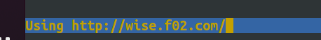

# Jarkom Modul 2 F02 2022

### Anggota:

1. [Andymas Narendra Bagaskara](https://github.com/zaibir123) (05111940000192)
2. [Jayanti Totti Andhina](https://github.com/JayantiTA) (5025201037)
3. [Gaudhiwaa Hendrasto](https://github.com/gaudhiwaa) (5025201066)

## Pembukaan Soal

Twilight (〈黄昏 (たそがれ) 〉, <Tasogare>) adalah seorang mata-mata yang berasal dari negara Westalis. Demi menjaga perdamaian antara Westalis dengan Ostania, Twilight dengan nama samaran Loid Forger (ロイド・フォージャー, Roido Fōjā) di bawah organisasi WISE menjalankan operasinya di negara Ostania dengan cara melakukan spionase, sabotase, penyadapan dan kemungkinan pembunuhan. Berikut adalah peta dari negara Ostania:


**1. WISE akan dijadikan sebagai DNS Master, Berlint akan dijadikan DNS Slave, dan Eden akan digunakan sebagai Web Server. Terdapat 2 Client yaitu SSS, dan Garden. Semua node terhubung pada router Ostania, sehingga dapat mengakses internet.**


**Ostania** sebagai router
Network configuration:

```
auto eth0
iface eth0 inet dhcp

auto eth1
iface eth1 inet static
	address 192.200.1.1
	netmask 255.255.255.0

auto eth2
iface eth2 inet static
	address 192.200.2.1
	netmask 255.255.255.0

auto eth3
iface eth3 inet static
	address 192.200.3.1
	netmask 255.255.255.0
```

Setup iptables:

```bash
iptables -t nat -A POSTROUTING -o eth0 -j MASQUERADE -s 192.200.0.0/16
```

**WISE** sebagai DNS master
Network configuration:

```
auto eth0
iface eth0 inet static
	address 192.200.2.2
	netmask 255.255.255.0
	gateway 192.200.2.1
```

Instalasi bind9:

```bash
apt update
apt install bind9 -y
```

**Berlint** sebagai DNS slave
Network configuration:

```
auto eth0
iface eth0 inet static
	address 192.200.3.2
	netmask 255.255.255.0
	gateway 192.200.3.1
```

Instalasi bind9:

```bash
apt update
apt install bind9 -y
```

**Eden** sebagai web server
Network configuration:

```
auto eth0
iface eth0 inet static
	address 192.200.3.3
	netmask 255.255.255.0
	gateway 192.200.3.1
```

**SSS** sebagai client
Network configuration:

```
auto eth0
iface eth0 inet static
	address 192.200.1.2
	netmask 255.255.255.0
	gateway 192.200.1.1
```

Instalasi dnsutils:

```bash
apt update
apt install dnsutils -y
```

**Gardent** sebagai client
Network configuration:

```
auto eth0
iface eth0 inet static
	address 192.200.1.3
	netmask 255.255.255.0
	gateway 192.200.1.1
```

Instalasi dnsutils:

```bash
apt update
apt install dnsutils -y
```

**2. Untuk mempermudah mendapatkan informasi mengenai misi dari Handler, bantulah Loid membuat website utama dengan akses wise.yyy.com dengan alias www.wise.yyy.com pada folder wise**

Lakukan perintah pada WISE. Isikan seperti berikut:

```bash
nano /etc/bind/named.conf.local
```

Isikan configurasi domain wise.f02.com sesuai dengan syntax berikut:

```bash
zone "wise.f02.com" {
	type master;
	file "/etc/bind/wise/wise.f02.com";
};
```

Buat folder wise di dalam /etc/bind

```bash
mkdir /etc/bind/wise
```

Copykan file db.local pada path /etc/bind ke dalam folder wise yang baru saja dibuat dan ubah namanya menjadi wise.f02.com

```bash
cp /etc/bind/db.local /etc/bind/wise/wise.f02.com
```

Kemudian buka file wise.f02.com dan edit seperti gambar berikut

```bash
nano /etc/bind/wise/wise.f02.com
```


Restart bind9 dengan perintah

```bash
service bind9 restart

ATAU

named -g //Bisa digunakan untuk restart sekaligus debugging
```

Hasil ping wise.f02.com


**3. Setelah itu ia juga ingin membuat subdomain eden.wise.yyy.com dengan alias www.eden.wise.yyy.com yang diatur DNS-nya di WISE dan mengarah ke Eden**

Pada WISE, edit file /etc/bind/wise/wise.f02.com lalu tambahkan subdomain untuk eden.wise.f02.com yang mengarah ke IP Eden.

```bash
nano /etc/bind/wise/wise.f02.com
```

Tambahkan konfigurasi seperti di bawah ke dalam file wise.f02.com.

```bash
eden   IN      A       192.200.2.3
www.eden IN    CNAME   eden.wise.f02.com.
```


Restart service bind

```bash
service bind9 restart
```

Ping ke subdomain dengan perintah berikut dari client

```bash
ping eden.wise.f02.com -c 5

ATAU

host -t A eden.wise.f02.com
```


**4. Buat juga reverse domain untuk domain utama**

Edit file /etc/bind/named.conf.local pada WISE

```bash
nano /etc/bind/named.conf.local
```

Lalu tambahkan konfigurasi berikut ke dalam file named.conf.local. Tambahkan reverse dari 3 byte awal dari IP yang ingin dilakukan Reverse DNS. IP 192.200.2 untuk IP dari records, maka reversenya adalah 2.200.192

```bash
zone "2.200.192.in-addr.arpa" {
    type master;
    file "/etc/bind/wise/2.200.192.in-addr.arpa";
};
```

Copykan file db.local pada path /etc/bind ke dalam folder wise yang baru saja dibuat dan ubah namanya menjadi 2.200.192.in-addr.arpa

```bash
cp /etc/bind/db.local /etc/bind/wise/2.200.192.in-addr.arpa
```

Kemudian restart bind9 dengan perintah

```bash
service bind9 restart
```

Untuk mengecek apakah konfigurasi sudah benar atau belum, lakukan perintah berikut pada client

```bash
apt-get update
apt-get install dnsutils
```

Kembalikan nameserver di /etc/resolv.conf dengan IP WISE

Maka dicek menggunakan command :

```bash
host -t PTR 192.200.2.2
```


**5. Agar dapat tetap dihubungi jika server WISE bermasalah, buatlah juga Berlint sebagai DNS Slave untuk domain utama**

I. Konfigurasi Pada Server WISE
Edit file /etc/bind/named.conf.local dan sesuaikan dengan syntax berikut

```bash
zone "wise.f02.com" {
    type master;
    notify yes;
    also-notify { 192.200.3.2; }; // Masukan IP Berlint
    allow-transfer { 192.200.3.2; }; // Masukan IP Berlint
    file "/etc/bind/wise/wise.f02.com";
};
```


Lakukan restart bind9

```bash
service bind9 restart
```

II. Konfigurasi pada Server Berlint

Buka Berlint dan update package lists dan install aplikasi bind9 dengan menjalankan command:

```bash
apt-get update
apt-get install bind9 -y
```

Kemudian buka file /etc/bind/named.conf.local pada Berlint dan tambahkan syntax berikut:

```bash
zone "wise.f02.com" {
    type slave;
    masters { 192.200.2.2; }; // Masukan IP WISE
    file "/var/lib/bind/wise.f02.com";
};
```

Lakukan restart bind9

```bash
service bind9 restart
```

III. Testing
Pada server WISE matikan service bind9

```bash
service bind9 stop
```

Pada client pastikan pengaturan nameserver mengarah ke IP WISE dan IP Berlint


Lakukan ping ke wise.f02.com pada client. Jika ping berhasil maka konfigurasi DNS slave telah berhasil


**6. Karena banyak informasi dari Handler, buatlah subdomain yang khusus untuk operation yaitu operation.wise.yyy.com dengan alias www.operation.wise.yyy.com yang didelegasikan dari WISE ke Berlint dengan IP menuju ke Eden dalam folder operation**

```bash
nano /etc/bind/wise/wise.f02.com
```


Kemudian edit file /etc/bind/named.conf.options pada WISE.

```bash
nano /etc/bind/named.conf.options
```

Kemudian comment dnssec-validation auto; dan tambahkan baris berikut pada /etc/bind/named.conf.options

```bash
allow-query{any;};
```

Kemudian edit file /etc/bind/named.conf.local menjadi seperti gambar di bawah:
zone "wise.f02.com" {
type master;
file "/etc/bind/wise/wise.f02.com";
allow-transfer { 192.200.3.2; }; // Masukan IP Berlint
};

restart bind9

```bash
service bind9 restart
```

II. Konfigurasi Pada Server Berlint
Pada Berlint edit file /etc/bind/named.conf.options

```bash
nano /etc/bind/named.conf.options
```

Kemudian comment dnssec-validation auto; dan tambahkan baris berikut pada /etc/bind/named.conf.options

```bash
allow-query{any;};
```

Lalu edit file /etc/bind/named.conf.local menjadi seperti gambar di bawah:


Kemudian buat direktori dengan nama operation. Copy db.local ke direktori tersebut dan edit namanya menjadi operation.wise.f02.com

```bash
mkdir /etc/bind/operation
cp /etc/bind/db.local /etc/bind/wise/operation.wise.f02.com
```

Kemudian edit file operation.wise.f02.com menjadi seperti dibawah ini


```bash
nano /etc/bind/operation/operation.wise.f02.com
```

Restart bind9

```bash
service bind9 restart
```

III. Testing

Ping operation.wise.f02.com pada client


**7. Untuk informasi yang lebih spesifik mengenai Operation Strix, buatlah subdomain melalui Berlint dengan akses strix.operation.wise.yyy.com dengan alias www.strix.operation.wise.yyy.com yang mengarah ke Eden**

Pada server Berlint buat domain untuk strix.operation.wise.f02.com dengan alias www.strix.operation.wise.f02.com. Instalasi bind terlebih dahulu

```bash
apt-get update
apt-get install bind9 -y
```

Edit folder operation.wise.f02.com

```bash
nano /etc/bind/operation/operation.wise.f02.com
```

edit seperti dibawah ini :


Restart bind9

```bash
service bind9 restart
```

Lakukan ping ke domain strix.operation.wise.f02.com dan www.strix.operation.wise.f02.com dari client


**8. Pertama dengan webserver www.wise.yyy.com. Pertama, Loid membutuhkan webserver dengan DocumentRoot pada /var/www/wise.yyy.com**

Masukkan config pada /etc/apache2/sites-available/wise.f02.com.conf

{width="6.267716535433071in"
height="3.263888888888889in"}

Download resource kemudian pindahkan ke /var/www/wise.f02.com

{width="6.267716535433071in"
height="0.5416666666666666in"}

Enable site wise.f02.com dan disable site 000-default, restart service
apache2

{width="3.375in" height="0.7083333333333334in"}

Kembalikan nameserver ke IP WISE, testing client

{width="6.267716535433071in" height="3.25in"}

**9. Setelah itu, Loid juga membutuhkan agar url www.wise.yyy.com/index.php/home dapat menjadi menjadi www.wise.yyy.com/home**

Isi /var/www/wise.f02.com/.htaccess

{width="6.267716535433071in"
height="3.263888888888889in"}

Isi /etc/apache2/sites-available/wise.f02.com.conf

{width="6.267716535433071in" height="3.25in"}

Enable module rewrite kemudian restart service apache2

{width="6.267716535433071in"
height="3.263888888888889in"}

**10. Setelah itu, pada subdomain www.eden.wise.yyy.com, Loid membutuhkan penyimpanan aset yang memiliki DocumentRoot pada /var/www/eden.wise.yyy.com**

Isi /etc/apache2/sites-available/eden.wise.f02.com.conf

{width="6.267716535433071in"
height="3.263888888888889in"}

Download resource dan pindahkan ke /var/www/eden.wise.f02.com

{width="6.267716535433071in"
height="0.4444444444444444in"}

Enable site eden.wise.f02.com dan restart service apache2

{width="3.7604166666666665in"
height="0.4895833333333333in"}

Testing:

{width="6.267716535433071in"
height="3.236111111111111in"}

**11. Akan tetapi, pada folder /public, Loid ingin hanya dapat melakukan directory listing saja**

Isi /etc/apache2/sites-available/eden.wise.f02.com.conf

{width="6.267716535433071in" height="3.25in"}

Restart service apache2, testing:

{width="6.267716535433071in"
height="3.2777777777777777in"}

**12. Tidak hanya itu, Loid juga ingin menyiapkan error file 404.html pada folder /error untuk mengganti error kode pada apache**

Isi /etc/apache2/sites-available/eden.wise.f02.com.conf

{width="6.267716535433071in"
height="3.263888888888889in"}

Restart service apache2, testing:

{width="6.267716535433071in" height="3.25in"}

**13. Loid juga meminta Franky untuk dibuatkan konfigurasi virtual host. Virtual host ini bertujuan untuk dapat mengakses file asset www.eden.wise.yyy.com/public/js menjadi www.eden.wise.yyy.com/js**

Isi /etc/apache2/sites-available/eden.wise.f02.com.conf

{width="6.267716535433071in"
height="3.263888888888889in"}

Enable module rewrite dan restart service apache2, testing:

{width="6.267716535433071in" height="3.25in"}


**14. Loid meminta agar www.strix.operation.wise.yyy.com hanya bisa diakses dengan port 15000 dan port 15500**

Tambahkan configuration pada /etc/apache2/sites-available/strix.operation.wise.f02.com.conf


Setting port


Buat folder /var/www/strix.operation.wise.f02.com dan masukkan resource yang ada ke daam folder tersebut


Restart apache2 kemudian akses
**[[www.strix.operation.wise.yyy.com]{.underline}](http://www.strix.operation.wise.yyy.com)**
dari client menggunakan port 15000 atau 15500


Jika tanpa port


**15. dengan autentikasi username Twilight dan password opStrix dan file di /var/www/strix.operation.wise.yyy**

Masukkan command pada Eden:


Tambahkan configuration pada /etc/apache2/sites-available/strix.operation.wise.f02.com.conf


Restart apache2 kemudian akses www.strix.operation.wise.yyy.com dari client menggunakan username dan password yang sudah di-setup


**16. dan setiap kali mengakses IP Eden akan dialihkan secara otomatis ke www.wise.yyy.com**

Tambahkan konfigurasi pada /etc/apache2/sites-available/000-default.conf


Tambahkan konfigurasi port apache2


Enable 000-default.conf kemudian restart service apache2, akses IP Eden dari client




**17. Karena website www.eden.wise.yyy.com semakin banyak pengunjung dan banyak modifikasi sehingga banyak gambar-gambar yang random, maka Loid ingin mengubah request gambar yang memiliki substring "eden" akan diarahkan menuju eden.png**

Tambahkan module rewrite pada .htaccess


Tambahkan konfigurasi pada /etc/apache2/sites-available/eden.wise.f02.com.conf


Kemudian enable module rewrite dan restart service apache2. Akses gambar dari client.


Jika tanpa 'eden'


