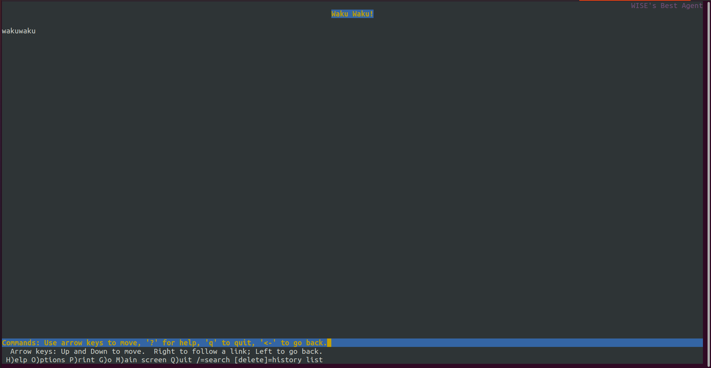
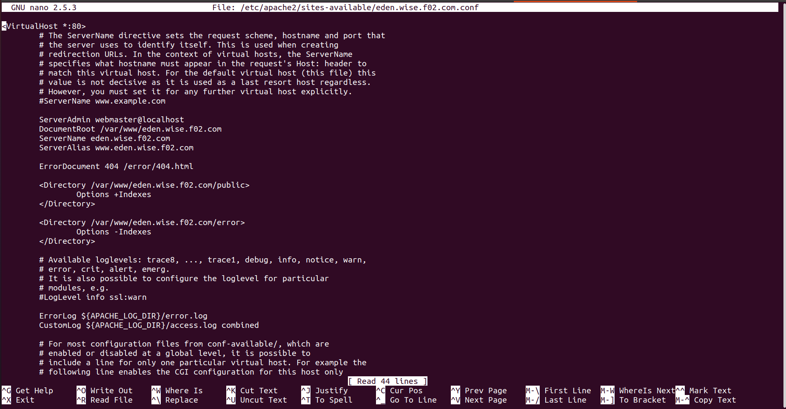
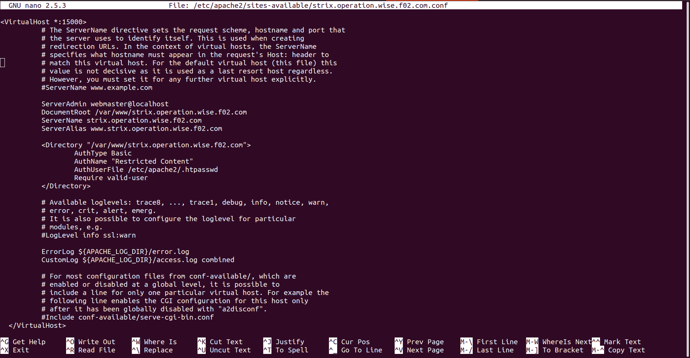

# Jarkom Modul 2 F02 2022

### Anggota:

1. [Andymas Narendra Bagaskara](https://github.com/zaibir123) (05111940000192)
2. [Jayanti Totti Andhina](https://github.com/JayantiTA) (5025201037)
3. [Gaudhiwaa Hendrasto](https://github.com/gaudhiwaa) (5025201066)

## Pembukaan Soal

Twilight (〈黄昏 (たそがれ) 〉, <Tasogare>) adalah seorang mata-mata yang berasal dari negara Westalis. Demi menjaga perdamaian antara Westalis dengan Ostania, Twilight dengan nama samaran Loid Forger (ロイド・フォージャー, Roido Fōjā) di bawah organisasi WISE menjalankan operasinya di negara Ostania dengan cara melakukan spionase, sabotase, penyadapan dan kemungkinan pembunuhan. Berikut adalah peta dari negara Ostania:


**1. WISE akan dijadikan sebagai DNS Master, Berlint akan dijadikan DNS Slave, dan Eden akan digunakan sebagai Web Server. Terdapat 2 Client yaitu SSS, dan Garden. Semua node terhubung pada router Ostania, sehingga dapat mengakses internet.**


**Ostania** sebagai router
Network configuration:

```
auto eth0
iface eth0 inet dhcp

auto eth1
iface eth1 inet static
	address 192.200.1.1
	netmask 255.255.255.0

auto eth2
iface eth2 inet static
	address 192.200.2.1
	netmask 255.255.255.0

auto eth3
iface eth3 inet static
	address 192.200.3.1
	netmask 255.255.255.0
```

Setup iptables:

```bash
iptables -t nat -A POSTROUTING -o eth0 -j MASQUERADE -s 192.200.0.0/16
```

**WISE** sebagai DNS master
Network configuration:

```
auto eth0
iface eth0 inet static
	address 192.200.2.2
	netmask 255.255.255.0
	gateway 192.200.2.1
```

Instalasi bind9:

```bash
apt update
apt install bind9 -y
```

**Berlint** sebagai DNS slave
Network configuration:

```
auto eth0
iface eth0 inet static
	address 192.200.3.2
	netmask 255.255.255.0
	gateway 192.200.3.1
```

Instalasi bind9:

```bash
apt update
apt install bind9 -y
```

**Eden** sebagai web server
Network configuration:

```
auto eth0
iface eth0 inet static
	address 192.200.3.3
	netmask 255.255.255.0
	gateway 192.200.3.1
```

**SSS** sebagai client
Network configuration:

```
auto eth0
iface eth0 inet static
	address 192.200.1.2
	netmask 255.255.255.0
	gateway 192.200.1.1
```

Instalasi dnsutils:

```bash
apt update
apt install dnsutils -y
```

**Gardent** sebagai client
Network configuration:

```
auto eth0
iface eth0 inet static
	address 192.200.1.3
	netmask 255.255.255.0
	gateway 192.200.1.1
```

Instalasi dnsutils:

```bash
apt update
apt install dnsutils -y
```

**14. Loid meminta agar www.strix.operation.wise.yyy.com hanya bisa diakses dengan port 15000 dan port 15500**

Tambahkan configuration pada /etc/apache2/sites-available/strix.operation.wise.f02.com.conf


Setting port



Buat folder /var/www/strix.operation.wise.f02.com dan masukkan resource yang ada ke daam folder tersebut


Restart apache2 kemudian akses www.strix.operation.wise.yyy.com dari client menggunakan port 15000 atau 15500


Jika tanpa port


**15. dengan autentikasi username Twilight dan password opStrix dan file di /var/www/strix.operation.wise.yyy**

Masukkan command pada Eden:


Tambahkan configuration pada /etc/apache2/sites-available/strix.operation.wise.f02.com.conf


Restart apache2 kemudian akses www.strix.operation.wise.yyy.com dari client menggunakan username dan password yang sudah di-setup


**16. dan setiap kali mengakses IP Eden akan dialihkan secara otomatis ke www.wise.yyy.com**

Tambahkan konfigurasi pada /etc/apache2/sites-available/000-default.conf


Tambahkan konfigurasi port apache2



Enable 000-default.conf kemudian restart service apache2, akses IP Eden dari client


**17. Karena website www.eden.wise.yyy.com semakin banyak pengunjung dan banyak modifikasi sehingga banyak gambar-gambar yang random, maka Loid ingin mengubah request gambar yang memiliki substring "eden" akan diarahkan menuju eden.png**

Tambahkan module rewrite pada .htaccess



Tambahkan konfigurasi pada /etc/apache2/sites-available/eden.wise.f02.com.conf


Kemudian enable module rewrite dan restart service apache2. Akses gambar dari client.


Jika tanpa 'eden'


